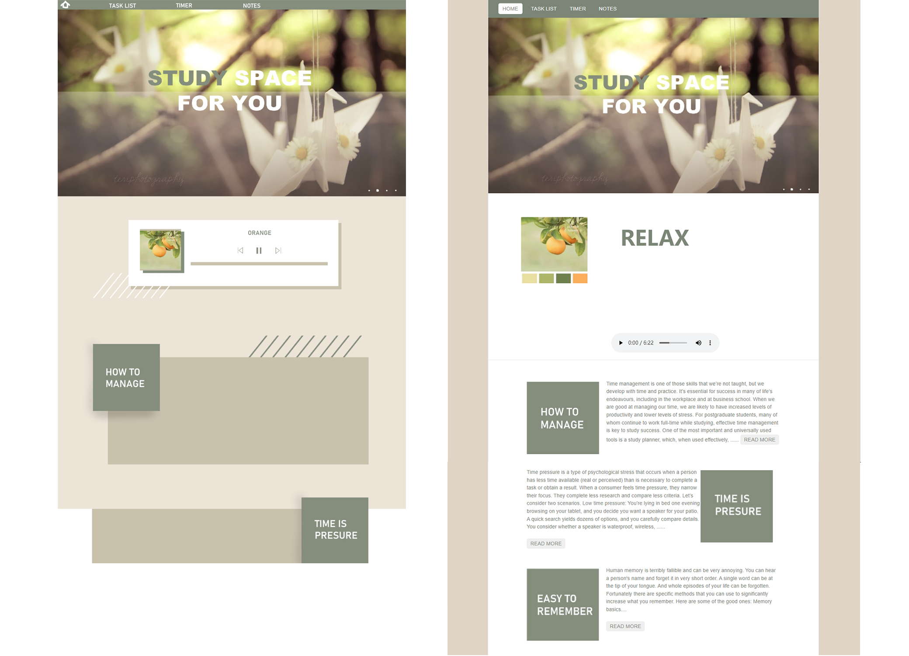
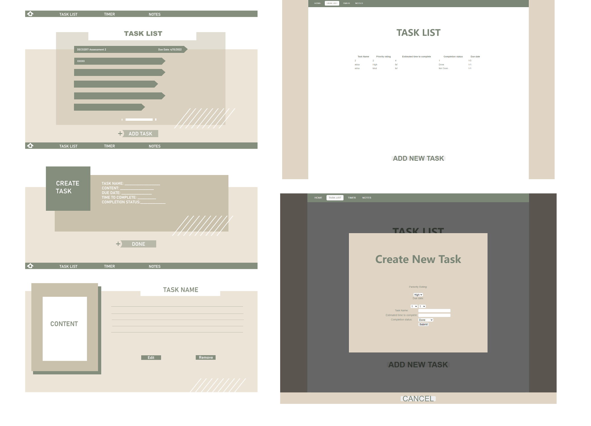
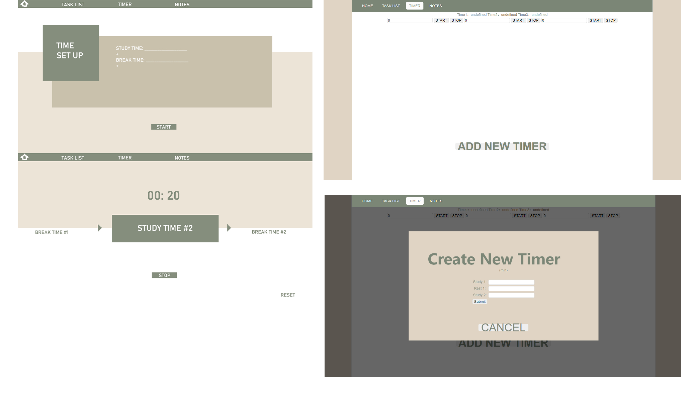
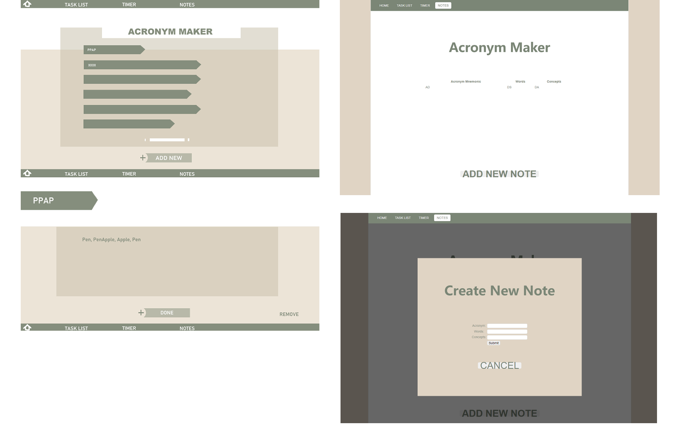

# STUDY SPACE FOR YOU:
> This is a study webstie for the students to manage their study. The users will be able to use four functions that are involved in this Web app prototype: Music Player, Tasklist, Timer and Acronym Maker.

## HOMEPAGE:
The homepage of the webstie mainly uses all the design elements I made in my mock up. The main color theme of the website uses the collocation of low saturation green and beige, which can make the users feel very relaxed, can more easily let students into the state of learning. The cover image and the location of the music player haven't changed much. 

The background of the interface and the background of the webstie has been switched because I want to create a strong color contrast between the text and the white background. This will make the lay out of the submain section clearer and easier to read.

## TASK LIST:
I have made some changes to the parts except the main page. To minimize the number of pages, I chose to use a floating window instead of a paging surface, which would reduce the wait time for users to switch pages. At the same time, it can make the picture more concise and hierarchical. In the part of filling in options, I use the select function to replace the part of intext, in order to make it more convenient for users to fill in task information, and also convenient for the system to classify and filter.

After the user submits the task information, they can see their tasklist displayed on the TaskList. They can see the Task Name,	Priority rating,	Estimated time to complete,	Completion status	and Due date. The localStorage function helps to save their data on the web enable to prevents the data from being flushed.

## TIMER:
There will be three variables for the users to set the timer. Two study timers and one break timer. When the first study timer is ended, it will automatically start the rest timer, and then start the second study timer. The timing will stop automatically when all the time is finished. The users can start and stop the timer through the buttons beside the timers. And they can also change the setting of the timers in the “ADD NEW TIMER” floating window. 

## NOTES:
THis section is using the Acronym Maker function to help the students remember the keywords of their concepts. This feature will display three sections: Acronym Mnemonic, Words and Concepts.

The section's arrangement is similar to the other sections I made before. I think using similar approach will greatly reduce the user's effort to learn different interface using method, and once they have accessed the first section, the memorized methods can be easily applied to other sections. 

## Reference:
Color templets image:  【Practical】fresh color matching 45 cases. (2016, March 22). Copyright © 2017 Sohu.Com Inc. All Rights Reserved. https://www.sohu.com/a/65066291_372415 

Cover image: TeriPhotography

Intext article:

How to Manage an Effective Study Schedule | AIB Official Blog. (2020b, September 7). Australian Institute of Business.
https://www.aib.edu.au/blog/study-tips/manage-an-effective-study-schedule/#:%7E:text=Time%20management%20is%20one%20of%20those%20skills%20that,levels%20of%20productivity%20and%20lower%20levels%20of%20stress.

Davis, P. (2016, July 29). What is Time Pressure and Why Does it Matter? AtData. https://www.atdata.com/blog/what-is-time-pressure

Memory methods. (n.d.-b). Changing Minds. http://changingminds.org/techniques/memory/memory.htm